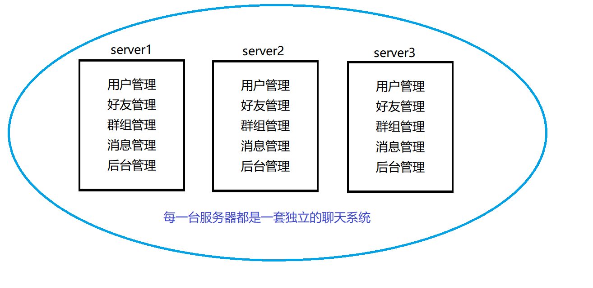

# mprpc
muduo &amp;&amp; protobuf &amp; rpc

## 背景
#### 集群的缺点：
~~~
    
~~~
1、项目代码任意模块的修改都会导致整个项目代码重新编译，部署。

2、系统中有些模块是属于CPU密集型（计算量大的），有些模块是属于I/O密集型的（接触 输入输出，网络I/O），造成各模块对硬件资源的需求是不一样。

#### 分布式优点：
1、用户登录成功，为了支持登录的并发量，我们可以把分布式节点1集群，扩充机器来部署运维用户管理，消息管理。

2、假设后台管理模块出问题，我只需要把server3这台机器的后台模块重新更新就可以了，其他模块不需要更新。

3、把CPU密集型的模块部署在CPU资源好的机器上。把内存小的模块部署在硬盘资源少的机器上。把I/O密集型的模块部署在CPU不是很好的机器上。
